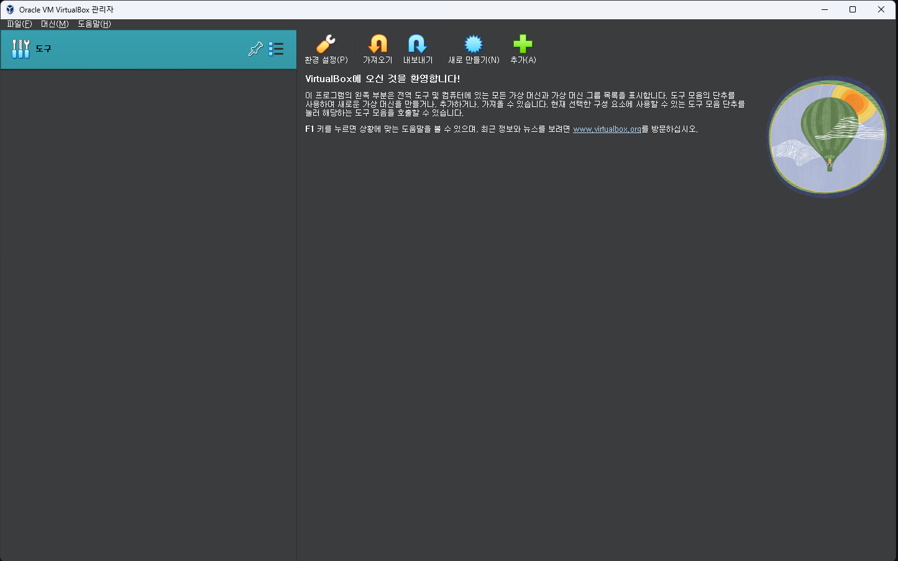
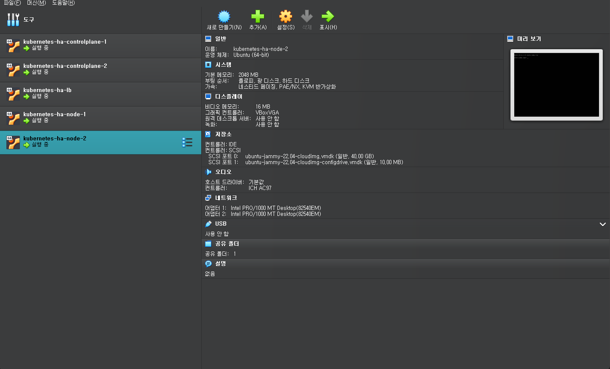
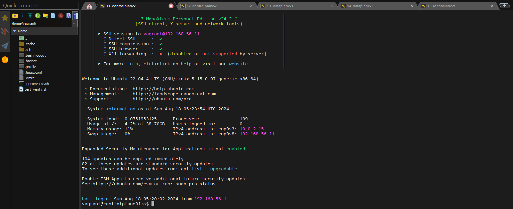

# Kubernetes The Hard Way on VirtualBox

### VirtualBox
1. VirtualBox를 Download 후 install 합니다.



### Vagrant

1. Vagrant는 VM을 만들어주는 도구로 여러 운영 체제와 호환됩니다. 저는 Mmumshad 께서 만들어주신 Vagrantfile을 이용하여서 아래와 같이 VM 설정을 진행하였습니다.



2. 이후 각 서버에 접근하기 위해서 Putty나 MobaXterm를 사용하여 VM 접속을 확인합니다.
 - 각 서버 IP 및 Port는 Vagrantfile을 참고하여 연결을 진행합니다.
 - ssh 접속시 유저는 vagrant로 설정합니다.

```
IP_NW = "192.168.56."

MASTER_IP_START = 10
NODE_IP_START = 20
LB_IP_START = 30

      //... (생략)...

      node.vm.hostname = "controlplane0#{i}"
      node.vm.network :private_network, ip: IP_NW + "#{MASTER_IP_START + i}"
      node.vm.network "forwarded_port", guest: 22, host: "#{2710 + i}"
      provision_kubernetes_node node

      //... (생략)...

      node.vm.hostname = "node0#{i}"
      node.vm.network :private_network, ip: IP_NW + "#{NODE_IP_START + i}"
      node.vm.network "forwarded_port", guest: 22, host: "#{2720 + i}"
      provision_kubernetes_node node

      //... (생략)...

```
3. VM 접속이 아래와 같이 가능합니다.

