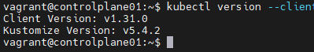

# Kubernetes The Hard Way

### Access to All VM
1. controlplane01에 접속하여 아래 명령어로 SSH Key Pair를 생성합니다.
2. 생성된 공개 키를 각 노드에 접속하여 등록 한 후 pubKey 등록을 확인 합니다. 
3. 이 것을 모든 노드에 반복하면 다른 public key를 통해서 해당 authorized_keys에 등록된 controlplane01 정보를 통해서 controlplane01 -> other node password 없이 가 가능해집니다.
4. 이 과정을 모든 노드에 반복합니다.

- 위 과정을 모두 끝낸 후 각 서버에서 ssh 접속을 하게 되면 ECDSA key fingerprint 등록 여부를 묻습니다. yes를 하게 되면 현재 서버에 known_hosts 파일이 생성되고 ssh로 연결되는 서버의 정보가 등록됩니다. 
- 그리고, 이미 pubkey를 모두 등록을 마친 상태로 인해서 ssh로 접속이 되어진 서버에는 authorized_keys가 등록되어 있으므로 패스워드 없이도 접근 가능하게 됩니다.

```
$ ssh-keygen

$ cat ~/.ssh/id_rsa.pub >> ~/.ssh/authorized_keys 

```


# Kubectl 설치

[Reference](https://kubernetes.io/docs/tasks/tools/install-kubectl/)

- 위 공식 문서를 참고하여 진행 한 후 kubectl 버전 확인 시 최신 버전임을 확인한다.




## 이번 장을 통해서 알 수 있었던 점

1. 공개키 등록을 통해서 비밀번호 없이도 서버 간 안전한 통신이 가능한 방법을 배웠습니다.
2. ECDSA Key Fingerprint 등록을 통해서 서버 간 신뢰성을 체크하고 이후에 known_hosts 파일에 서버 정보가 등록되어 보안성을 강화 함을 인지 했습니다.
3. kubectl을 직접 설치하고 버전 확인을 통해서 정상 등록 여부를 파악 할 수 있었습니다.
