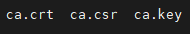
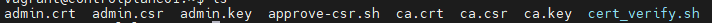

# Kubernetes The Hard Way

## Provisioning a CA and Generating TLS Certificates

이 문서는 PKI (Public Key Infrastructure) 인프라를 구축하고 TLS(Transport Layer Security) 인증서를 생성하는 방법을 설명하는 가이드입니다. 구체적으로는, openssl 도구를 사용하여 **Certificate Authority(CA)**를 부트스트랩하고, Kubernetes 클러스터의 다양한 구성 요소를 위한 TLS 인증서를 생성하는 과정을 다룹니다.

## Certificate Authority

- 인증 기관 (CA)를 통해서 TLS certificates 를 생성 할 수 있게 구축해봅시다.

- 인증서의 호스트 정보를 우선 가져와야 하며 '/etc/hosts'를 참조합니다.

- 환경 변수를 아래와 같이 설정 합시다.

지금 controlplane 및 lb를 환경 변수로 연결 하였습니다.
```
CONTROL01=$(dig +short controlplane01)
CONTROL02=$(dig +short controlplane02)
LOADBALANCER=$(dig +short loadbalancer)
```

```
SERVICE_CIDR=10.96.0.0/24
API_SERVICE=$(echo $SERVICE_CIDR | awk 'BEGIN {FS="."} ; { printf("%s.%s.%s.1", $1, $2, $3) }')
```

CA 인증 기관을 만들고 공개키를 만들어서 csr을 만듭시다.

```
{
  # Create private key for CA
  openssl genrsa -out ca.key 2048

  # Create CSR using the private key ca.key로 ca.csr이라는 인증서 서명 요청을 생성합니다. -subj "/CN=KUBERNETES-CA/O=Kubernetes" 옵션은 각각 CN (Common Name), (O) 조직 네임을 뜻 합니다. 그리고, 이는 csr에 포함될 주체 정보를 지정하는 것 입니다. 
  openssl req -new -key ca.key -subj "/CN=KUBERNETES-CA/O=Kubernetes" -out ca.csr

  # 자체 서명한 인증서를 발급합는데 이는 --signkey ca.key는 키를 지정하여 서명을하고 -CAcreateserial 옵션은 ca.srl이라는 CA 시리얼 파일을 생성하고 -out은 ca.crt의 결과롤 생성된 인증서를 ca.crt에 저장합니다. 그리고, 마지막으로는 -days 1000으로 유효 기간을 설정했습니다.
  openssl x509 -req -in ca.csr -signkey ca.key -CAcreateserial -out ca.crt -days 1000
}
```


- 이렇게 만들어진 ca.crt / ca.key는 쿠버네티스 컴포넌트의 수많은 파일에서 사용 될 것입니다. (예: Kube-scheduler, kube-apiserver,...)

## Client and Server Certificates

- Kubenetes Admin 유저를 위해서 쿠버네티스 컴포넌트끼리 클라이언트와 서버간의 인증서를 만들어 봅시다.

### The Admin Client Certificate

admin 클라이언트의 인증서와 개인키를 아래와 같이 생성 합니다.

```
{
  # Generate private key for admin user
  openssl genrsa -out admin.key 2048

  # Generate CSR for admin user. Note the OU.
  openssl req -new -key admin.key -subj "/CN=admin/O=system:masters" -out admin.csr

  # Sign certificate for admin user using CA servers private key
  openssl x509 -req -in admin.csr -CA ca.crt -CAkey ca.key -CAcreateserial -out admin.crt -days 1000
}
```


### Kubenetes Component Certificates

**Kubelet**

```
{
  openssl genrsa -out kube-controller-manager.key 2048

  openssl req -new -key kube-controller-manager.key \
    -subj "/CN=system:kube-controller-manager/O=system:kube-controller-manager" -out kube-controller-manager.csr

  openssl x509 -req -in kube-controller-manager.csr \
    -CA ca.crt -CAkey ca.key -CAcreateserial -out kube-controller-manager.crt -days 1000
}
```

Result : 
```
subject=CN = system:kube-controller-manager, O = system:kube-controller-manager
```

**Kube Proxy**

```
{
  openssl genrsa -out kube-proxy.key 2048

  openssl req -new -key kube-proxy.key \
    -subj "/CN=system:kube-proxy/O=system:node-proxier" -out kube-proxy.csr

  openssl x509 -req -in kube-proxy.csr \
    -CA ca.crt -CAkey ca.key -CAcreateserial -out kube-proxy.crt -days 1000
}
```
Result :
```
subject=CN = system:kube-proxy, O = system:node-proxier
```

**Kube-scheduler**

```
{
  openssl genrsa -out kube-scheduler.key 2048

  openssl req -new -key kube-scheduler.key \
    -subj "/CN=system:kube-scheduler/O=system:kube-scheduler" -out kube-scheduler.csr

  openssl x509 -req -in kube-scheduler.csr -CA ca.crt -CAkey ca.key -CAcreateserial -out kube-scheduler.crt -days 1000
}
```

Result : 
```
subject=CN = system:kube-scheduler, O = system:kube-scheduler
```

**Kubernetes API Certificates**
- Kubernetes API 서버는 클러스터 내 다양한 구성 요소들이 접근 할 수 있는 여러 이름의 인증서를 SAN(Subject Alternative Names)으로 포함하여야 합니다. 따라서, SAN에 DNS 네임과 IP 주소 등을 포함 시켜 놓아야 합니다.
- 아래 DNS 서버가 굉장히 친숙하게 다가옵니다. 그렇습니다. 저희가 일반적으로 svc.cluster.local으로 사용하던 서비스 도메인 네임은 이렇게 구성이 되어서 사용 할 수 있습니다.

```
cat > openssl.cnf <<EOF
[req]
req_extensions = v3_req
distinguished_name = req_distinguished_name
[req_distinguished_name]
[v3_req]
basicConstraints = critical, CA:FALSE
keyUsage = critical, nonRepudiation, digitalSignature, keyEncipherment
extendedKeyUsage = serverAuth
subjectAltName = @alt_names
[alt_names]
DNS.1 = kubernetes
DNS.2 = kubernetes.default
DNS.3 = kubernetes.default.svc
DNS.4 = kubernetes.default.svc.cluster
DNS.5 = kubernetes.default.svc.cluster.local
IP.1 = ${API_SERVICE}
IP.2 = ${CONTROL01}
IP.3 = ${CONTROL02}
IP.4 = ${LOADBALANCER}
IP.5 = 127.0.0.1
EOF
```

- 개인키 생성 및 CA 인증

```
{
  openssl genrsa -out kube-apiserver.key 2048

  openssl req -new -key kube-apiserver.key \
    -subj "/CN=kube-apiserver/O=Kubernetes" -out kube-apiserver.csr -config openssl.cnf

  openssl x509 -req -in kube-apiserver.csr \
    -CA ca.crt -CAkey ca.key -CAcreateserial -out kube-apiserver.crt -extensions v3_req -extfile openssl.cnf -days 1000
}
```
Result : 
```
subject=CN = kube-apiserver, O = Kubernetes
```

**APIServer Kubelet 클라이언트 인증서**

- API Server는 Kubelet과도 통신을 해야하기 때문에 Kubelet 인증서를 사용해서 신원을 증명합니다.
- extendedKeyUsage = clientAuth가 클라이언트 인증용임을 증명합니다.
```
cat > openssl-kubelet.cnf <<EOF
[req]
req_extensions = v3_req
distinguished_name = req_distinguished_name
[req_distinguished_name]
[v3_req]
basicConstraints = critical, CA:FALSE
keyUsage = critical, nonRepudiation, digitalSignature, keyEncipherment
extendedKeyUsage = clientAuth
EOF
```

```
{
  openssl genrsa -out apiserver-kubelet-client.key 2048

  openssl req -new -key apiserver-kubelet-client.key \
    -subj "/CN=kube-apiserver-kubelet-client/O=system:masters" -out apiserver-kubelet-client.csr -config openssl-kubelet.cnf

  openssl x509 -req -in apiserver-kubelet-client.csr \
    -CA ca.crt -CAkey ca.key -CAcreateserial -out apiserver-kubelet-client.crt -extensions v3_req -extfile openssl-kubelet.cnf -days 1000
}
```
Result : 
```
subject=CN = kube-apiserver-kubelet-client, O = system:masters

```

**ETCD Service Certificate**

- ETCD 클러스터 또한, 여러 서버에 접근이 가능해야 하므로 아래와 같이 설정을 진행합니다. (Controlplane 연결)

```
cat > openssl-etcd.cnf <<EOF
[req]
req_extensions = v3_req
distinguished_name = req_distinguished_name
[req_distinguished_name]
[ v3_req ]
basicConstraints = CA:FALSE
keyUsage = nonRepudiation, digitalSignature, keyEncipherment
subjectAltName = @alt_names
[alt_names]
IP.1 = ${CONTROL01}
IP.2 = ${CONTROL02}
IP.3 = 127.0.0.1
EOF
```

```
{
  openssl genrsa -out etcd-server.key 2048

  openssl req -new -key etcd-server.key \
    -subj "/CN=etcd-server/O=Kubernetes" -out etcd-server.csr -config openssl-etcd.cnf

  openssl x509 -req -in etcd-server.csr \
    -CA ca.crt -CAkey ca.key -CAcreateserial -out etcd-server.crt -extensions v3_req -extfile openssl-etcd.cnf -days 1000
}
```
Result :
```
subject=CN = etcd-server, O = Kubernetes
```

**The Service Account Key Pair** 

- Kubernetes Controller Manager가 서비스 어카운트의 JWT 토큰을 생성하고 이를 서명하기 위해서 사용하는 키 페어를 생성하는 작업입니다.
- 클러스터 내부의 파드가 K8S API 서버와 통신하기 위해서 사용하는 것이 서비스 어카운트인데 이를 사실은 백 단에서 작업을 통해서 사용을 할 수 있었습니다.

```
{
  openssl genrsa -out service-account.key 2048

  openssl req -new -key service-account.key \
    -subj "/CN=service-accounts/O=Kubernetes" -out service-account.csr

  openssl x509 -req -in service-account.csr \
    -CA ca.crt -CAkey ca.key -CAcreateserial -out service-account.crt -days 1000
}
```
Result:

```
subject=CN = service-accounts, O = Kubernetes
```

**Verify PKI**
- Controlplan1 에서 실행 시켜 봅시다.
```
./cert_verify.sh
```
Result:
```
ca cert and key found, verifying the authenticity
ca cert and key are correct
kube-apiserver cert and key found, verifying the authenticity
kube-apiserver cert and key are correct
kube-controller-manager cert and key found, verifying the authenticity
kube-controller-manager cert and key are correct
kube-scheduler cert and key found, verifying the authenticity
kube-scheduler cert and key are correct
service-account cert and key found, verifying the authenticity
service-account cert and key are correct
apiserver-kubelet-client cert and key found, verifying the authenticity
apiserver-kubelet-client cert and key are correct
etcd-server cert and key found, verifying the authenticity
etcd-server cert and key are correct
admin cert and key found, verifying the authenticity
admin cert and key are correct
kube-proxy cert and key found, verifying the authenticity
kube-proxy cert and key are correct

```

**인증서를 타 controlplan으로 복사하기**

- ssh 설정을 미리 해둔 덕분에 패스워드 전달 없이 끝낼 수 있습니다.
```
{
for instance in controlplane01 controlplane02; do
  scp -o StrictHostKeyChecking=no ca.crt ca.key kube-apiserver.key kube-apiserver.crt \
    apiserver-kubelet-client.crt apiserver-kubelet-client.key \
    service-account.key service-account.crt \
    etcd-server.key etcd-server.crt \
    kube-controller-manager.key kube-controller-manager.crt \
    kube-scheduler.key kube-scheduler.crt \
    ${instance}:~/
done

for instance in node01 node02 ; do
  scp ca.crt kube-proxy.crt kube-proxy.key ${instance}:~/
done
}
```


## 이번 장을 통해서 알 수 있었던 점

PKI : 인증 구조 퍼블릭 키 인프라스트럭쳐 이것의 행동 양식을 이해했습니다. (client가 server의 pubKey를 통해서 암호화하면 서버에서는 이를 자신의 개인키로 복호화 해서 사용 할 수 있습니다.)

CA : 인증 기관으로 pubKey (공개키) 가 변경되지 않음을 보장합니다.

TLS : 네트워크 통신에서 보안을 제공하며 서버와 클라이언트간 안전한 통신을 보장합니다. 

- Defalut DNS 서비스 생성 과정 및 Service Account의 동작이 가능했던 이유에 대해서 알 수 있었습니다.

