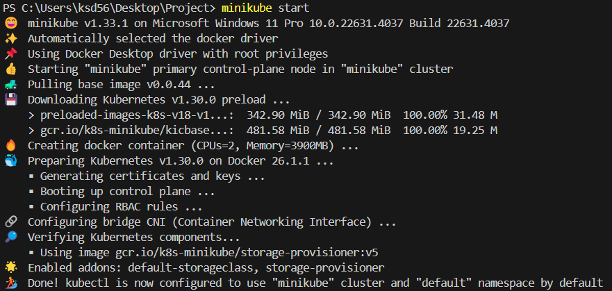

# Minikube 설치 가이드

이 가이드는 로컬 머신에 Minikube를 설치하는 방법에 대한 단계별 지침을 제공합니다. Minikube는 로컬에서 Kubernetes 클러스터를 실행할 수 있게 해주는 도구로, 개발 및 테스트 목적으로 단일 노드 Kubernetes 클러스터를 생성합니다.

## 설치 단계

### 1. Minikube 설치

먼저, Windows PowerShell을 **관리자 모드**로 실행한 후, 다음 명령어를 입력하여 Minikube를 설치합니다:

```powershell
# C 드라이브에 Minikube 폴더 생성
New-Item -Path 'c:\' -Name 'minikube' -ItemType Directory -Force

# Minikube 실행 파일 다운로드
Invoke-WebRequest -OutFile 'c:\minikube\minikube.exe' -Uri 'https://github.com/kubernetes/minikube/releases/latest/download/minikube-windows-amd64.exe' -UseBasicParsing

# 시스템 환경 변수에 Minikube 경로 추가
$oldPath = [Environment]::GetEnvironmentVariable('Path', [EnvironmentVariableTarget]::Machine)
if ($oldPath.Split(';') -notcontains 'C:\minikube') {
    [Environment]::SetEnvironmentVariable('Path', $('{0};C:\minikube' -f $oldPath), [EnvironmentVariableTarget]::Machine)
}
```

위 명령어를 실행하면 Minikube 실행 파일이 `C:\minikube\` 경로에 다운로드되고, 해당 경로가 시스템의 환경 변수에 추가됩니다. 이로 인해 명령어 `minikube`를 어디서든 실행할 수 있게 됩니다.

### 2. Minikube 시작

Minikube 설치가 완료되면, 다음 명령어를 입력하여 Minikube를 시작할 수 있습니다:

```powershell
minikube start
```

Minikube가 성공적으로 시작되면, Kubernetes 클러스터가 로컬에서 실행되며, 아래와 같이 출력이 표시됩니다:



### 3. Minikube 제어

Minikube를 중지하거나 다시 시작하려면 다음 명령어를 사용하세요:

```powershell
minikube stop  # 중지
minikube start  # 시작
```


이 명령어를 통해 Minikube를 중지하거나 다시 시작할 수 있습니다. Minikube를 통해 Kubernetes 클러스터를 손쉽게 관리할 수 있습니다.